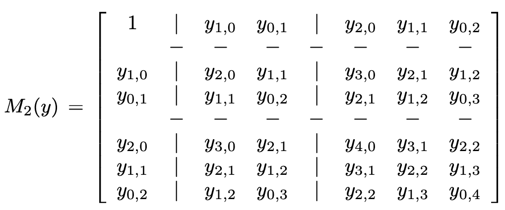

This note is taken from the [summer course](https://sites.google.com/site/cedricjosz/home/introduction-to-polynomial-optimization), in which Prof.Cédric Josz makes everything clear and intuitive! This blog is about multivariate polynomial optimization, including both unconstrained and constrained cases. In particular, we are interested in the moment method for GLOBAL polynomial optimization, proposed by:

> ”Global Optimization with Polynomials and the problem of moments”, by Jean B. Lasserre (2001)

### Moment Problem

To get some intuition of the moment approach, we transform the optimization problem over a set of points into the ones over a set of measures. To be specific, a polynomial optimization problem

$$
\inf_{x \in \mathbb{R}^n} f(x) \quad \text{s.t.} \quad x\in K:=\{x \in \mathbb{R}^n|g_i(x) \geq 0, i=1,...,m\}
$$

is equivalent to the convex problem

$$
\inf_{\mu \in \mathcal M(K)}\quad \int f \text{d} \mu\\
\text{s.t.} \quad \int 1 \text{d} \mu =1 ,\mu \geq 0
$$

where $\mathcal M(K)$ denotes the set of finite Borel measures on $K$. Let $x^{\star}=\arg\min_{x\in K} f(x)$ , then $\mu^{\star}=\delta_{x^{\star}}$ is the optimal solution of the moment problem.

### Multivariant Setup

Consider a $n$ variants $m$ degree polynomial  $\sum_{\alpha} p_{\alpha} x^{\alpha}$, where $x_{\alpha}=x_1^{\alpha_1}x_2^{\alpha_2}...x_n^{\alpha_n},\sum_i \alpha_i \leq m$. It is defined on a basis

$$
1,x_1,...,x_n,x_1^2,...,x_1 x_n,x_2^2,...,x_n^2,...,x_1^m,x_n^m
$$

with dimension $s(2m)$. For moment $y_{\alpha}=\int x^{\alpha} \text{d} \mu$, they compose a $s(2m)$-degree vector of moments $y=\{y_{\alpha}\}$, with $y_{0,...,0}=1$. Then we introduce moment matrix $M_m(y)\in \mathbb R^{s(m)\times s(m)}$.  This matrix is defined by blocks $\{M_{\alpha}(y)\}_{\sum_i \alpha_i=k,1\leq k \leq 2m}$. Here is an example of the moment matrix with $n=2,m=2$:

Given $y$ with $M_m(y)\succeq 0$, the theory of moments identifies whether it corresponds to some probability measure $\mu_y$.  For univariant case, the positive semideifiniteness is necessary and sufficient to guarantee the existence of  $\mu_y$. However, in multivariant case, there are vectors $y$ with  $M_m(y)\succ 0$ but no representing $\mu_y$. In addition, this theory of moments is in duality with the theory of nonnegative polynomials on SOS representations.

### Unconstrained Case

For unconstrained $n$ variants $m$ degree polynomial optimization problem $\min_{x\in \mathbb{R}^n} \sum_{\alpha} p_{\alpha} x^{\alpha}$, where $x_{\alpha}=x_1^{\alpha_1}x_2^{\alpha_2}...x_n^{\alpha_n},\sum_i \alpha_i \leq m$, the moment method solves

$$
P=\min_y \sum_{\alpha} p_{\alpha} y_{\alpha}\\
\text{s.t.}\quad y_{\alpha}=\int x^{\alpha} \text{d} \mu,\quad y_{0}=\int x^{0} \text{d} \mu=1
$$

This problem is hard to optimize. Therefore, we consider the relaxed problem

$$
Q=\min_y \sum_{\alpha} p_{\alpha} y_{\alpha}\\
\text{s.t.} M_m(y)\succeq 0
$$

where $M_m(y)$ is the moment matrix defined in the previous section. The condition for the equivalence of $P$ and $Q$ is established through the following theorem.

***Theorem***

If the nonnegative polynomial $p(x)-p^*$ is a sum-of-squares of polynomials, then $P$ is equivalent to $Q$.

------

The theorem suggests that, in an ideal case, we can solve $Q$ directly to obtain global optimality. However, in a more general case where the condition is not necessarily satisfied, we need to solve a sequence of SDP to approach global optimality. 

Suppose $x^*=\arg \min_x p(x)$ exists. 

Then for $N \geq m$, as $N$ tends to infinity, one has $Q_a^N$ -> $p^*$, where 

$$
Q_a^N=\min_y \sum_{\alpha} p_{\alpha} y_{\alpha}\\
\text{s.t.} M_N(y)\succeq 0\\
M_{N-1}(\theta y)\succeq 0
$$

and $\theta(x)=a-\|x\|^2$, $M_{N-1}(\theta y)(i,j)=\sum_{\alpha} \theta_{\alpha} y_{\beta (i,j)+\alpha}$. For instance,

### Constrained Case

If the problem is constrained to the set

$$
K:=\{x \in \mathbb{R}^n|g_i(x) \geq 0, i=1,...,m\}
$$

one has similar result  $Q_K^N$ ->$ p^*$ as $N$ tends to infinity, where

$$
Q_a^N=\min_y \sum_{\alpha} p_{\alpha} y_{\alpha}\\
\text{s.t.} M_N(y)\succeq 0\\
M_{N-\text{deg}(g_i)/2}(g_i y)\succeq 0
$$
